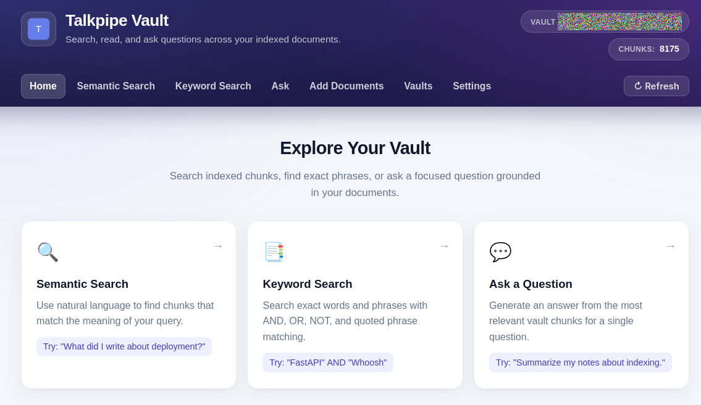
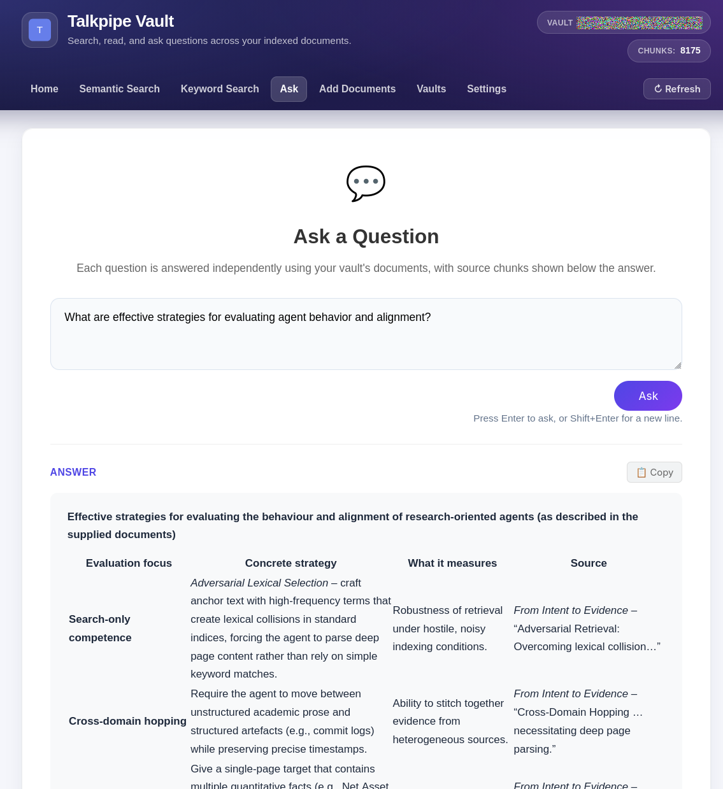

<p align="center">
  
</p>

# TalkPipe Vault

> AI-powered personal information assistant for building and searching document vaults

[](https://www.python.org/downloads/)
[](https://opensource.org/licenses/Apache-2.0)
[](https://github.com/sandialabs/talkpipe-vault)

<p align="center">

</p>
<p align="center">

</p>

## What is TalkPipe Vault?

NOTE: TalkPipe Vault is still under development (in alpha) and is not intended for production use.

**TalkPipe Vault** is a set of practical tools and reusable components for turning folders of files into a searchable "vault" you can explore with semantic search, keyword search, and retrieval-augmented Q&A. It is a production-oriented example built on the **[TalkPipe](https://github.com/sandialabs/talkpipe)** framework, demonstrating how to assemble document processing, vector search, and RAG with clean, composable pipelines.

What you get:
- **A self-contained web application**: `vault-server` starts a FastAPI UI where you can create or choose a vault, index documents into it, configure the embedding and chat models, and then explore it with semantic search, keyword search, and single-turn Q&A — all from the browser.
- **Command-line indexing through TalkPipe**: alternatively, use TalkPipe's `makevectordatabase` command to create the LanceDB `docs` table consumed by the web application.
- **Reusable building blocks**: TalkPipe sources, segments, and end-to-end pipelines that you can compose to build your own file/document management workflows.

How it works (at a glance):
- Converts documents to text and stores embeddings in LanceDB for semantic search and RAG.
- Can build a Whoosh full-text index for precise keyword queries alongside semantic search.
- Supports local models (Ollama) and cloud providers (OpenAI) via simple configuration.

Together, these applications and components provide both ready-to-use capabilities and a clear blueprint for creating custom pipelines with TalkPipe.

### Current Status

The stable runtime path is: start `vault-server`, then create a vault and index documents from the web interface — or build the vault ahead of time with TalkPipe's `makevectordatabase`.

Directory monitoring is still under development. The watcher sources and helper functions are present in `talkpipe_vault.watchdog` and `talkpipe_vault.pipelines.building_and_watching`, but they are not part of the default runtime and should be treated as experimental until the indexing and serving paths are fully unified.

### Key Features

- **Web Search and Q&A**: Search an existing vault from a browser
- **Experimental Directory Monitoring**: Watcher components exist, but the monitoring workflow is still being hardened
- **Semantic Search**: Find documents by meaning, not just keywords
- **Multiple AI Backends**: Embeddings run fully in-process by default (model2vec, no server or API key); OpenAI and local Ollama models are supported for embeddings and chat
- **Format Support**: Handles diverse document formats through the extraction pipeline
- **Vector Database**: Uses [LanceDB](https://lancedb.com/) for efficient similarity search

### Web Interface

TalkPipe Vault includes a web application for building, searching, and querying your document collection:

- **Vaults**: Create a new vault or choose an existing one with a built-in folder browser; recently used vaults are listed on the Vaults page at the next start so they can be reopened with one click
- **Add Documents**: Index a folder (pickable with the folder browser) or glob pattern of documents into the current vault
- **Settings**: Configure the provider (source) and model for both embeddings and chat, plus chunking and Ask retrieval sizes. The page also shows a live **Configuration status** panel that tests whether the selected providers are reachable (with a Re-test button and concrete fix hints), and a **Connections & credentials** section where you can enter API keys (OpenAI, Anthropic), an OpenAI-compatible base URL, and the Ollama server URL directly in the browser — no environment variables required
- **Semantic Search**: Find documents by meaning using AI-powered vector similarity search
- **Keyword Search**: Traditional full-text search with boolean operators (AND, OR, NOT) and phrase matching. Matching is case-insensitive but on exact word tokens (no stemming), so `apple` will not match `apples` — use semantic search for meaning-based lookups, or search the exact word form.
- **Ask a Question**: Get AI-generated answers based on your vault's contents (single-turn Q&A)
- **Copy Results**: Easily copy search results or answers to clipboard

**Launch the web interface** (after installing the package — see
[Installation](#installation) below):

```bash
vault-server
```

Then open http://127.0.0.1:8002 in your browser and create or choose a vault from the Vaults page. To open a vault directly, pass its path:

```bash
vault-server ~/my-vault --host 127.0.0.1 --port 8002
```

## Quick Start

### Installation

Install TalkPipe Vault from PyPI:

```bash
# Create and activate a virtual environment first. Recent Linux distributions
# (Debian/Ubuntu/Fedora) mark the system Python as "externally managed" (PEP 668),
# so installing into it fails; a venv avoids that.
python -m venv .venv
source .venv/bin/activate      # Windows: .venv\Scripts\activate

pip install talkpipe-vault
```

This installs the `vault-server` command along with TalkPipe and its
`makevectordatabase` command, so you're ready to jump to [Basic Usage](#basic-usage).

Alternatively, to work from source (for example to contribute), clone the
repository and do an editable install:

```bash
git clone https://github.com/sandialabs/talkpipe-vault.git
cd talkpipe-vault
python -m venv .venv
source .venv/bin/activate      # Windows: .venv\Scripts\activate
pip install -e .
```

(Add the `[dev]` extra — `pip install -e ".[dev]"` — if you also want the test and
lint tools; see [Development Setup](#development-setup) for the full workflow.)

### Basic Usage

**Option 1 — everything in the browser:**

```bash
vault-server
```

Open http://127.0.0.1:8002, create a vault on the **Vaults** page, index a folder of documents on the **Add Documents** page, and start searching. Pick your embedding and chat models on the **Settings** page (defaults: `model2vec` embeddings that run fully in-process with no server or API key, and Ollama with `mistral-small` for chat answers).

**Option 2 — build the vault from the command line:**

```bash
makevectordatabase "/path/to/documents/**/*.txt" \
    --path ~/my-vault \
    --embedding_source model2vec \
    --embedding_model minishlab/potion-retrieval-32M \
    --overwrite

vault-server ~/my-vault --host 127.0.0.1 --port 8002
```

`vault-server` expects a LanceDB directory containing TalkPipe's `docs` table; `makevectordatabase` creates that layout. Note that `makevectordatabase` requires the embedding configuration explicitly — pass `--embedding_source`/`--embedding_model` or set `default_embedding_model_source`/`default_embedding_model_name` in `~/.talkpipe.toml` (or as `TALKPIPE_*` environment variables).

To show file-path links in search results, add `--show-source-paths` (hidden by default).

### Experimental Directory Monitoring

Directory monitoring is not the recommended production path yet. The installed package currently exposes only `vault-server` as a console script.

For local experiments, you can call the watcher helper directly:

```bash
python -c "from talkpipe_vault.pipelines.cli import watch_vectordb_main; watch_vectordb_main()" \
    /path/to/documents \
    --vault-path ~/watched-vault \
    --patterns "*.txt" "*.md" \
    --polling \
    --overwrite
```

The watcher pipeline writes LanceDB content directly under `~/watched-vault` and Whoosh data under `~/watched-vault/fulltext_vault`.

One expectation to set before trying it: the watcher reacts only to filesystem
events that happen **after** it starts — files already in the directory are not
indexed (use the `list_vectordb_main` helper below for an existing set of files).
Each indexed chunk is printed as a `{'shingle_id': ...}` line, so you can watch
files being processed; the results land in the vault's LanceDB tables.

---

## For Developers

### Architecture

TalkPipe Vault is built on [TalkPipe](https://github.com/sandialabs/talkpipe), a Python framework for composable data pipelines. The project provides custom TalkPipe sources and segments for document processing and vector database creation.

**Technology Stack:**

- **Pipeline Framework**: TalkPipe for composable data processing
- **Document Processing**: Text extraction pipeline for document conversion
- **Vector Database**: LanceDB for semantic search
- **Full-Text Search**: Whoosh for keyword-based search
- **File Monitoring**: Watchdog for filesystem events
- **Web Framework**: FastAPI with Jinja2 templates
- **AI/Embeddings**: model2vec (in-process, default), Ollama (local inference), or OpenAI API

### Processing Pipeline

The stable web application reads a LanceDB directory containing TalkPipe's `docs` table. The **Add Documents** page creates that database with TalkPipe's document pipeline; TalkPipe's `makevectordatabase` command produces the same layout:

```bash
makevectordatabase "/path/to/documents/**/*.txt" --path ~/my-vault \
    --embedding_source model2vec --embedding_model minishlab/potion-retrieval-32M --overwrite
```

The in-development monitoring pipeline uses a separate internal flow:

```text
File event -> document parsing -> filtering -> full-document embedding ->
text chunking -> shingle generation -> chunk embedding -> vector storage
```

That watcher flow stores LanceDB tables directly at `vault_path` (`full_documents`, `shingled_chunks`) and writes Whoosh data under `fulltext_vault`. It is useful for development and integration work, but the recommended user-facing workflow is still `makevectordatabase` plus `vault-server`.

### Command-Line Tools

TalkPipe Vault currently installs `vault-server` as its package console script. Indexing is handled by TalkPipe's `makevectordatabase` command, which is installed with the TalkPipe dependency.

#### `makevectordatabase`

Builds the LanceDB `docs` table used by `vault-server`. Embedding configuration is required — pass it explicitly or set it in the TalkPipe config.

```bash
makevectordatabase "/path/to/documents/**/*.txt" \
    --path ~/my-vault \
    --embedding_source model2vec \
    --embedding_model minishlab/potion-retrieval-32M \
    --overwrite
```

#### `vault-server`

Launches the web interface. The vault path is optional; without it, create or choose a vault on the Vaults page.

```bash
vault-server [~/my-vault] [--host 0.0.0.0] [--port 8002] [--show-source-paths] [--no-browser]
```

The web interface provides:
- **Vaults**: Create a new vault or choose an existing one
- **Add Documents**: Index a folder or glob pattern into the current vault
- **Settings**: Choose the embedding and chat source/model
- **Semantic Search**: Vector similarity search to find documents by meaning
- **Keyword Search**: Full-text search when a Whoosh index is available
- **Ask**: Single-turn Q&A that retrieves relevant context and generates AI responses

`--show-source-paths` shows source file paths in search results and serves the files over HTTP; they are hidden by default. `--no-browser` skips opening the interface in a web browser on startup (useful for headless servers and services).

#### Python Module Entry Point

The app module can also be run directly with the same options:

```bash
python -m talkpipe_vault.apps.query ~/my-vault --host 0.0.0.0 --port 8002
```

#### Experimental Watcher Helpers

The old `vault-watch-into-vectordb` and `vault-list-into-vectordb` console scripts are not currently installed by `pyproject.toml`. Their helper functions still exist for development testing:

```bash
python -c "from talkpipe_vault.pipelines.cli import list_vectordb_main; list_vectordb_main()" \
    "/path/to/documents/**/*.txt" \
    --vault-path ~/watched-vault \
    --overwrite
```

These helpers exercise the directory-monitoring and custom vault-building code that is still under development.

### Custom TalkPipe Components

TalkPipe Vault registers custom sources and segments with TalkPipe:

**Sources:**
- `fileWatcher`: File system event monitoring; experimental
- `watchIntoVectorDB`: Combined watching and vector database creation; experimental
- `listIntoVectorDB`: Batch processing from glob patterns for the in-development custom vault layout

**Segments:**
- `buildVectorDBFromPaths`: Complete document processing pipeline
- `vaultSearch`: Semantic search on vault's vector database
- `vaultTextSearch`: Full-text keyword search using Whoosh index
- `vaultChat`: RAG-based Q&A using vault contents

### Building Your Own Pipelines

One of TalkPipe's strengths is composability. Here's how TalkPipe Vault builds complex functionality from simple pipeline operators:

> **Note:** Examples 1–3 below use the **experimental** watcher/list components
> (`fileWatcher`, `watchIntoVectorDB`, `listIntoVectorDB`). They are useful for
> understanding composition and for development, but the watcher pipelines write the
> experimental `full_documents`/`shingled_chunks` layout, **not** the `docs` table that
> `vault-server` reads. For the stable path, index with `makevectordatabase` or the
> **Add Documents** page. See [Current Status](#current-status).

**Example 1: Simple file watching pipeline**

```python
from talkpipe_vault.watchdog import file_watcher
from talkpipe.pipe.io import Print

# Watch a directory and print events
pipeline = file_watcher(path="/path/to/watch") | Print()

# Run the pipeline. file_watcher runs until interrupted (Ctrl+C), so this loop
# does not return on its own — each iteration yields one filesystem event.
for event in pipeline():
    # Process events as they occur
    pass
```

**Example 2: Complete document processing (from TalkPipe Vault source)**

Note that `ReadFile` stores an `ExtractionResult` object (with `.content`,
`.source`, `.title` fields) in the target field, not a plain string — filter
expressions must go through `.content` to reach the text:

```python
from talkpipe_vault.watchdog import file_watcher
from talkpipe.data.extraction import ReadFile
from talkpipe.pipe.basic import FilterExpression
from talkpipe.pipelines.vector_databases import MakeVectorDatabaseSegment

# Build a complete document intelligence pipeline by chaining components
pipeline = \
    file_watcher(path="/path/to/watch") | \
    FilterExpression(expression="item['event'] != 'deleted'") | \
    ReadFile(field="path", set_as="full_content") | \
    FilterExpression(expression="len(item['full_content'].content.strip()) > 0") | \
    MakeVectorDatabaseSegment(
        path="~/my-vault",
        embedding_model="mxbai-embed-large:latest",
        embedding_source="ollama",
        embedding_field="full_content",
        table_name="documents",
        doc_id_field="path"
    )

# Run the pipeline
for result in pipeline():
    print(f"Processed: {result['path']}")
```

Two practical notes on this example: Ollama components read the server URL from
`TALKPIPE_OLLAMA_SERVER_URL` (or `OLLAMA_SERVER_URL` in `~/.talkpipe.toml`,
default `http://localhost:11434`) — see
[Provider-Specific Configuration](#provider-specific-configuration) if your
server is remote. Also expect a single file save to produce more than one event
(typically `created` followed by `modified`), so a file can be processed twice
in a row; the vector database deduplicates by `doc_id_field`, so the end state
is still one record per file.

**Example 3: Using registered components via configuration**

The registered sources and segments (see [Custom TalkPipe Components](#custom-talkpipe-components))
can be referenced by name from a TalkPipe **chatterlang** script, which you compile with
`talkpipe.compile`. This batch example indexes a glob of files with the experimental
`listIntoVectorDB` source (note the parameter is `source_pattern`, not a directory path):

```python
import talkpipe

# Registered components are discovered from installed plugins.
talkpipe.load_plugins()

pipeline = talkpipe.compile(
    'INPUT FROM listIntoVectorDB['
    '  source_pattern="/path/to/documents/**/*.txt",'
    '  vault_path="~/watched-vault",'
    '  embedding_source="model2vec",'
    '  embedding_model="minishlab/potion-retrieval-32M",'
    '  overwrite=True'
    ']'
)

# Run it. Each yielded item is an indexed chunk
# (keys: shingle_id, shingle, source, title).
chunks = list(pipeline())
print(f"Indexed {len(chunks)} chunk(s) into the vault.")
```

To watch a directory instead of processing a fixed glob, use the `watchIntoVectorDB`
source (which takes `source_path` and `polling`) in place of `listIntoVectorDB` — it runs
until interrupted. Both write the experimental `full_documents`/`shingled_chunks` layout
rather than the `docs` table used by `vault-server`.

This composability is what makes TalkPipe powerful: you can build sophisticated AI applications by connecting well-tested components.

### Vault Storage Structure

**Stable layout** (what `vault-server` reads) — produced by the **Add Documents** page and
by TalkPipe's `makevectordatabase`:

- `docs`: LanceDB table of document/chunk embeddings (TalkPipe's `DEFAULT_VECTOR_TABLE_NAME`)
- `fulltext_vault`: Whoosh full-text index, created on demand from the **Keyword Search** page
- `vault_metadata.json`: records the embedding source/model (and vector dimension) the vault
  was indexed with, so reopening the vault automatically uses a matching embedder; it travels
  with the vault if the folder is copied or moved. This file is written by the **Add
  Documents** page — vaults built with `makevectordatabase` alone don't have it and are
  treated as legacy vaults (the Settings page flags them when the current embedder may not
  match the index)

**Experimental watcher layout** — produced by the in-development pipelines in
[src/talkpipe_vault/pipelines/building_and_watching.py](src/talkpipe_vault/pipelines/building_and_watching.py)
(`listIntoVectorDB`/`watchIntoVectorDB`, see [Current Status](#current-status)). These tables
are **not** read by `vault-server`:

- `full_documents`: Embeddings for templated full-document content (unique id is document-based)
- `shingled_chunks`: Embeddings for overlapping chunk windows with composite ids like `first-last-source`
- `fulltext_vault`: Whoosh full-text index over full document content

### Development Setup

```bash
# Clone repository
git clone https://github.com/sandialabs/talkpipe-vault.git
cd talkpipe-vault

# Create and activate a virtual environment (see the note under Installation
# about PEP 668 / "externally managed" system Python)
python -m venv .venv
source .venv/bin/activate      # Windows: .venv\Scripts\activate

# Install with development dependencies
pip install -e ".[dev]"

# Run tests
pytest

# Run tests with coverage
pytest --cov=src --cov-report=term-missing --cov-report=html

# Code formatting
black src/ tests/
isort src/ tests/

# Linting
flake8 src/ tests/

# Type checking (advisory: CI runs it but allows failures; strict mode still
# reports pre-existing issues)
mypy src/

# Security scanning
bandit -r src/
safety check
```

### Model Configuration & Environment

TalkPipe Vault supports flexible model configuration through multiple methods, with the following precedence (highest to lowest):

1. **Explicit parameters** in code/CLI (always takes precedence)
2. **Web interface Settings page** (persisted under `~/.talkpipe-vault/settings.json`; override the location with `TALKPIPE_VAULT_HOME`)
3. **TalkPipe configuration** (from `~/.talkpipe.toml` or `TALKPIPE_*` environment variables)
4. **Default values** in `config.py` (fallback)

API keys and connection URLs entered under **Settings → Connections & credentials**
are persisted separately to `~/.talkpipe-vault/credentials.json` (created with
owner-only permissions) and applied to the vault process only — your shell
environment and `~/.talkpipe.toml` are left untouched.

#### Configuration Methods

**Method 1: TalkPipe Config File (`~/.talkpipe.toml`)**

Create or edit `~/.talkpipe.toml`:

```toml
[vault]
embedding_model = "text-embedding-3-large"
embedding_source = "openai"
chat_model = "gpt-4"
chat_source = "openai"
```

Or use top-level keys:

```toml
embedding_model = "text-embedding-3-large"
embedding_source = "openai"
chat_model = "gpt-4"
chat_source = "openai"
```

**Method 2: Environment Variables**

Set environment variables with `TALKPIPE_` prefix:

```bash
export TALKPIPE_EMBEDDING_MODEL="text-embedding-3-large"
export TALKPIPE_EMBEDDING_SOURCE="openai"
export TALKPIPE_CHAT_MODEL="gpt-4"
export TALKPIPE_CHAT_SOURCE="openai"
```

**Method 3: Default Values**

If not configured via TalkPipe, defaults from `config.py` are used:
- **Embeddings:** `EMBEDDING_MODEL="minishlab/potion-retrieval-32M"`, `EMBEDDING_SOURCE="model2vec"`
- **Chat:** `CHAT_MODEL="mistral-small"`, `CHAT_SOURCE="ollama"`

#### Supported Configuration Keys

The following keys are recognized (checked in order):

| Key | Alternative Keys | Description | Default |
|-----|------------------|-------------|---------|
| `embedding_model` | `EMBEDDING_MODEL`, `default_embedding_model_name` | Model name for generating embeddings | `minishlab/potion-retrieval-32M` |
| `embedding_source` | `EMBEDDING_SOURCE`, `default_embedding_model_source` | Provider for embedding model (`model2vec`, `ollama`, `openai`) | `model2vec` |
| `chat_model` | `CHAT_MODEL`, `default_model_name` | Model name for chat/completion | `mistral-small` |
| `chat_source` | `CHAT_SOURCE`, `default_model_source` | Provider for chat model (`ollama`, `openai`, `anthropic`, `eliza`) | `ollama` |
| `document_template` | `DOCUMENT_TEMPLATE` | Template for formatting full documents before embedding. Placeholders: `{title}`, `{content}` | `"title: {title} \| text: {content}"` |
| `shingle_template` | `SHINGLE_TEMPLATE` | Template for formatting shingled chunks before embedding. Placeholders: `{title}`, `{shingle}` | `"title: {title} \| text: {shingle}"` |
| `retrieval_template` | `RETRIEVAL_TEMPLATE` | Template for formatting search queries before embedding. Placeholders: `{query}` | `"task: search result \| query: {query}"` |

Keys can be specified:
- In the `[vault]` section of `~/.talkpipe.toml`
- At the top level of `~/.talkpipe.toml`
- As `TALKPIPE_*` environment variables (uppercase)

#### Provider-Specific Configuration

**model2vec (default for embeddings):**
- Set `embedding_source="model2vec"` (embeddings only — chat needs a generative provider)
- Runs fully in-process: no server, no API key. The model (default
  `minishlab/potion-retrieval-32M`) is downloaded from Hugging Face on first use and
  cached locally; use TalkPipe's `talkpipe_precache_model2vec` command to prefetch it
  for offline machines.

**OpenAI:**
- Set `embedding_source="openai"` and/or `chat_source="openai"`
- Ensure `OPENAI_API_KEY` is set in your environment

**Ollama:**
- Set `embedding_source="ollama"` and/or `chat_source="ollama"`
- Customize the server URL in the web interface (**Settings → Connections & credentials**), with the `TALKPIPE_OLLAMA_SERVER_URL` environment variable, or with `OLLAMA_SERVER_URL` in `~/.talkpipe.toml` (default: `http://localhost:11434`). The model must already be pulled on that server.

**Anthropic (chat only):**
- Set `chat_source="anthropic"` and a model name such as `claude-sonnet-4-5`
- Enter the API key in the web interface (**Settings → Connections & credentials**) or set `ANTHROPIC_API_KEY` in your environment

**eliza (chat only, built-in):**
- Set `chat_source="eliza"` for a rule-based responder that needs no server or
  API key — useful for smoke-testing the Ask page and retrieval wiring before a
  real chat provider is configured (it does not use the retrieved context)

#### Example: Switching to OpenAI

```bash
# Via environment variables
export TALKPIPE_EMBEDDING_MODEL="text-embedding-3-large"
export TALKPIPE_EMBEDDING_SOURCE="openai"
export TALKPIPE_CHAT_MODEL="gpt-4"
export TALKPIPE_CHAT_SOURCE="openai"
export OPENAI_API_KEY="sk-your-key-here"
```

Or via config file (`~/.talkpipe.toml`):

```toml
[vault]
embedding_model = "text-embedding-3-large"
embedding_source = "openai"
chat_model = "gpt-4"
chat_source = "openai"
```

Then set `OPENAI_API_KEY` in your environment.

#### Example: Customizing Templates

Templates control how text is formatted before embedding. You can customize them to improve embedding quality:

```bash
# Via environment variables
export TALKPIPE_DOCUMENT_TEMPLATE="Document: {title}\nContent: {content}"
export TALKPIPE_SHINGLE_TEMPLATE="Chunk from {title}: {shingle}"
export TALKPIPE_RETRIEVAL_TEMPLATE="Search for: {query}"
```

Or via config file (`~/.talkpipe.toml`):

```toml
[vault]
document_template = "Document: {title}\nContent: {content}"
shingle_template = "Chunk from {title}: {shingle}"
retrieval_template = "Search for: {query}"
```

**Template Placeholders:**
- `document_template`: `{title}`, `{content}`
- `shingle_template`: `{title}`, `{shingle}`
- `retrieval_template`: `{query}`

#### Overriding in Code

You can still override configuration explicitly when calling segments/sources.
Note that calling a segment factory like `build_vector_db_from_paths(...)` only
*constructs* a pipeline segment — nothing is indexed until you feed items
through it and consume the results:

```python
from talkpipe_vault.pipelines.building_and_watching import build_vector_db_from_paths

# Explicit override (takes precedence over all config)
indexer = build_vector_db_from_paths(
    vault_path="/path/to/vault",
    embedding_model="minishlab/potion-retrieval-32M",
    embedding_source="model2vec",
)

# Feed file paths through the segment and consume it to run the indexing.
items = [{"path": "/path/to/documents/notes.txt"}]
for chunk in indexer(items):
    print(f"Indexed chunk: {chunk['shingle_id']}")
```

### Project Structure

```
talkpipe-vault/
├── src/
│   └── talkpipe_vault/
│       ├── pipelines/
│       │   ├── building_and_watching.py    # Core pipeline logic
│       │   ├── searching_and_prompting.py  # Search and RAG segments
│       │   ├── config.py                   # Default configuration
│       │   └── cli.py                      # CLI entry points
│       ├── apps/
│       │   ├── query.py                    # Web application
│       │   ├── vault_server.py             # vault-server CLI entry point
│       │   ├── user_settings.py            # Persisted UI settings (vaults, models)
│       │   ├── templates/                  # HTML templates
│       │   └── static/                     # Static assets
│       └── watchdog.py                     # File system monitoring
├── docs/
│   └── talkpipe_vault.jpg                  # Project logo
├── tests/                                  # Test suite
└── pyproject.toml                          # Package configuration
```

## Requirements

- **Python**: 3.11.4 or higher
- **Ollama** (optional): For chat answers with local models (embeddings work out of the box via model2vec)
- **OpenAI API Key** (optional): For cloud-based embeddings or chat

## Contributing

Contributions are welcome! Please ensure:

1. Tests pass: `pytest`
2. Code is formatted: `black src/ tests/ && isort src/ tests/`
3. Linting passes: `flake8 src/ tests/`
4. Type checking is advisory: run `mypy src/` and avoid introducing new errors (CI allows it to fail)

## License

Apache License 2.0 - See [LICENSE](LICENSE) file for details.

## Authors

- **Travis Bauer** - *Initial development* - [Sandia National Laboratories](https://www.sandia.gov/)

## Acknowledgments

- Built with [TalkPipe](https://github.com/sandialabs/talkpipe)
- Vector storage using [LanceDB](https://lancedb.com/)
- File monitoring with [Watchdog](https://github.com/gorakhargosh/watchdog)

---

**Status**: Alpha - Active development. APIs may change.
