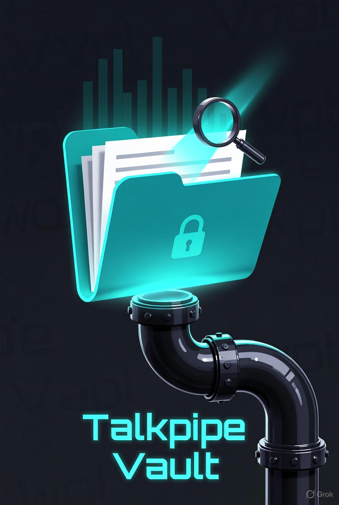
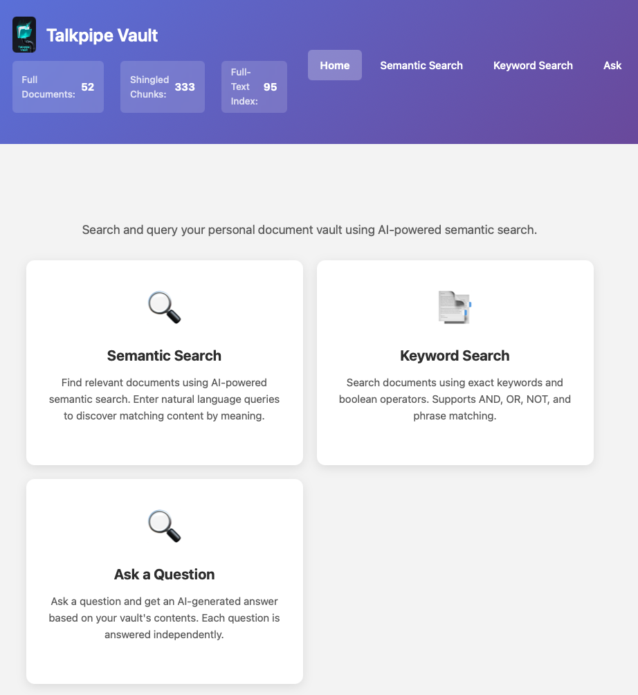

<p align="center">
  
</p>

# TalkPipe Vault

> AI-powered personal information assistant for building and searching document vaults

[](https://www.python.org/downloads/)
[](https://opensource.org/licenses/Apache-2.0)
[](https://github.com/sandialabs/talkpipe-vault)

<p align="center">

</p>

## What is TalkPipe Vault?

NOTE: TalkPipe Vault is still under development (in alpha) and not all features are intended for broad use.

**TalkPipe Vault** is a set of practical tools and reusable components for turning folders of files into a searchable "vault" you can explore with semantic search, keyword search, and retrieval-augmented Q&A. It is a production-oriented example built on the **[TalkPipe](https://github.com/sandialabs/talkpipe)** framework, demonstrating how to assemble document processing, vector search, and RAG with clean, composable pipelines.

What you get:
- **A web application for discovery**: `vault-server` starts a FastAPI UI for semantic search, keyword search, and single-turn Q&A over an existing vault.
- **Command-line indexing through TalkPipe**: use TalkPipe's `makevectordatabase` command to create the LanceDB `docs` table consumed by the web application.
- **Reusable building blocks**: TalkPipe sources, segments, and end-to-end pipelines that you can compose to build your own file/document management workflows.

How it works (at a glance):
- Converts documents to text and stores embeddings in LanceDB for semantic search and RAG.
- Can build a Whoosh full-text index for precise keyword queries alongside semantic search.
- Supports local models (Ollama) and cloud providers (OpenAI) via simple configuration.

Together, these applications and components provide both ready-to-use capabilities and a clear blueprint for creating custom pipelines with TalkPipe.

### Current Status

The stable runtime path is: build a vault with TalkPipe's `makevectordatabase`, then serve it with `vault-server` either locally or in a container.

Directory monitoring is still under development. The watcher sources and helper functions are present in `talkpipe_vault.watchdog` and `talkpipe_vault.pipelines.building_and_watching`, but they are not started by the default container and should be treated as experimental until the indexing and serving paths are fully unified.

### Key Features

- **Web Search and Q&A**: Search an existing vault from a browser
- **Experimental Directory Monitoring**: Watcher components exist, but the monitoring workflow is still being hardened
- **Semantic Search**: Find documents by meaning, not just keywords
- **Multiple AI Backends**: Works with OpenAI or local Ollama models (privacy-friendly, no cloud required)
- **Format Support**: Handles diverse document formats through the extraction pipeline
- **Vector Database**: Uses [LanceDB](https://lancedb.com/) for efficient similarity search

### Web Interface

TalkPipe Vault includes a web application for searching and querying your document collection:

- **Semantic Search**: Find documents by meaning using AI-powered vector similarity search
- **Keyword Search**: Traditional full-text search with boolean operators (AND, OR, NOT) and phrase matching
- **Ask a Question**: Get AI-generated answers based on your vault's contents (single-turn Q&A)
- **Copy Results**: Easily copy search results or answers to clipboard

**Launch the web interface:**

```bash
vault-server ~/my-vault --host 127.0.0.1 --port 8002
```

Then open http://127.0.0.1:8002 in your browser.

## Quick Start

### Installation

```bash
# Install from source
git clone https://github.com/sandialabs/talkpipe-vault.git
cd talkpipe-vault
pip install -e .

# For development
pip install -e .[dev]
```

### Basic Usage

**Build a vault from existing files:**

```bash
makevectordatabase "/path/to/documents/**/*.txt" \
    --path ~/my-vault \
    --overwrite
```

`vault-server` expects a LanceDB directory containing TalkPipe's `docs` table. The `makevectordatabase` command above creates that layout.

**Run the web interface from the command line:**

```bash
vault-server ~/my-vault --host 127.0.0.1 --port 8002
```

Then open http://127.0.0.1:8002 in your browser.

**Run the web interface with Python directly:**

```bash
python -m talkpipe_vault.apps.query ~/my-vault --host 127.0.0.1 --port 8002
```

Use this form when you need options exposed by the app module, such as `--show-source-paths`.

### Experimental Directory Monitoring

Directory monitoring is not the recommended production path yet. The default container does not start a watcher, and the installed package currently exposes only `vault-server` as a console script.

For local experiments, you can call the watcher helper directly:

```bash
python -c "from talkpipe_vault.pipelines.cli import watch_vectordb_main; watch_vectordb_main()" \
    /path/to/documents \
    --vault-path ~/watched-vault \
    --patterns "*.txt" "*.md" \
    --polling \
    --overwrite
```

The watcher pipeline writes LanceDB content directly under `~/watched-vault` and Whoosh data under `~/watched-vault/fulltext_vault`.

---

## Container Deployment

TalkPipe Vault can run in a Podman or Docker-compatible container with no local Python installation. The default container serves the web interface for an existing vault; it does not start a live file watcher.

### Prerequisites

- [Podman](https://podman.io/) installed
- For local AI models: [Ollama](https://ollama.ai/) reachable from the container. The examples use `http://deeplearn:11434`; change `OLLAMA_BASE_URL` if your Ollama server is elsewhere.

### Build the Image

```bash
podman build -t talkpipe-vault -f Containerfile .
```

### Build a Vault in the Container

Mount your document directory and a host data directory, then run TalkPipe's `makevectordatabase` inside the image:

```bash
mkdir -p ~/Desktop/talkpipe-vault-data/vault

podman run --rm \
    --userns=keep-id \
    --add-host=host.containers.internal:host-gateway \
    -v /path/to/documents:/documents:Z \
    -v ~/Desktop/talkpipe-vault-data:/app/data:Z \
    -e OLLAMA_BASE_URL=http://deeplearn:11434 \
    talkpipe-vault \
    makevectordatabase "/documents/**/*.txt" \
        --path /app/data/vault \
        --overwrite
```

If you already built the vault locally at `~/Desktop/talkpipe-vault-data/vault`, skip this step and run the server container directly.

### Run the Web Server Container

```bash
podman run --rm -p 8002:8002 \
    --name talkpipe-vault \
    --userns=keep-id \
    --add-host=host.containers.internal:host-gateway \
    -v ~/Desktop/talkpipe-vault-data:/app/data:Z \
    talkpipe-vault
```

The web interface is at **http://localhost:8002**. The vault database is stored under `~/Desktop/talkpipe-vault-data/vault` on the host and mounted at `/app/data/vault` in the container.

### Run With Compose

You can also build and run the web server from the repository with Compose-compatible tooling. The production service uses a named volume at `/app/data`; use direct `podman run` with a bind mount when you want to point the container at a specific host vault directory.

```bash
# Production web service
docker-compose up vault

# Development container
docker-compose --profile dev up vault-dev
```

### Experimental Monitoring in a Container

Directory monitoring remains experimental. If you want to test it in a container, override the default command and mount both the watched directory and the output directory:

```bash
podman run --rm \
    --userns=keep-id \
    --add-host=host.containers.internal:host-gateway \
    -v /path/to/documents:/documents:Z \
    -v ~/Desktop/talkpipe-vault-data:/app/data:Z \
    -e OLLAMA_BASE_URL=http://deeplearn:11434 \
    talkpipe-vault \
    python -c "from talkpipe_vault.pipelines.cli import watch_vectordb_main; watch_vectordb_main()" \
        /documents \
        --vault-path /app/data/watched-vault \
        --patterns "*.txt" "*.md" \
        --polling
```

This is for development testing, not unattended production monitoring.

### Debugging

Connect to a running container with standard Podman commands:

```bash
podman ps
podman exec -it talkpipe-vault /bin/bash
```

### Ollama Access

Set `OLLAMA_BASE_URL` to the URL that is reachable from inside the container. If Ollama runs on `deeplearn`, use:

```bash
podman run -it --rm \
    --name talkpipe-vault \
    --userns=keep-id \
    -p 8002:8002 \
    --add-host=host.containers.internal:host-gateway \
    -v ~/Desktop/talkpipe-vault-data:/app/data:Z \
    # VAULT_PATH points to the LanceDB directory directly.
    -e VAULT_PATH=/app/data/vault \
    -e OLLAMA_BASE_URL=http://deeplearn:11434 \
    talkpipe-vault
```

If Ollama runs on the same host as Podman, use `http://host.containers.internal:11434` instead.

### Troubleshooting

**Permission errors on vault directory**

Use `--userns=keep-id` so the container runs as your user. If problems persist:

```bash
chmod -R u+rwX ~/Desktop/talkpipe-vault-data/vault
```

**Ollama not reachable**

Ensure the hostname is reachable from inside the container and that Ollama is listening on a non-loopback interface on that machine. For a remote server such as `deeplearn`, `OLLAMA_BASE_URL` should be `http://deeplearn:11434`.

---

## For Developers

### Architecture

TalkPipe Vault is built on [TalkPipe](https://github.com/sandialabs/talkpipe), a Python framework for composable data pipelines. The project provides custom TalkPipe sources and segments for document processing and vector database creation.

**Technology Stack:**

- **Pipeline Framework**: TalkPipe for composable data processing
- **Document Processing**: Text extraction pipeline for document conversion
- **Vector Database**: LanceDB for semantic search
- **Full-Text Search**: Whoosh for keyword-based search
- **File Monitoring**: Watchdog for filesystem events
- **Web Framework**: FastAPI with Jinja2 templates
- **AI/Embeddings**: OpenAI API or Ollama (local inference)

### Processing Pipeline

The stable web application reads a LanceDB directory containing TalkPipe's `docs` table. Create that database with TalkPipe's `makevectordatabase` command:

```bash
makevectordatabase "/path/to/documents/**/*.txt" --path ~/my-vault --overwrite
```

The in-development monitoring pipeline uses a separate internal flow:

```text
File event -> document parsing -> filtering -> full-document embedding ->
text chunking -> shingle generation -> chunk embedding -> vector storage
```

That watcher flow stores LanceDB tables directly at `vault_path` (`full_documents`, `shingled_chunks`) and writes Whoosh data under `fulltext_vault`. It is useful for development and integration work, but the recommended user-facing workflow is still `makevectordatabase` plus `vault-server`.

### Command-Line Tools

TalkPipe Vault currently installs `vault-server` as its package console script. Indexing is handled by TalkPipe's `makevectordatabase` command, which is installed with the TalkPipe dependency.

#### `makevectordatabase`

Builds the LanceDB `docs` table used by `vault-server`.

```bash
makevectordatabase "/path/to/documents/**/*.txt" \
    --path ~/my-vault \
    --overwrite
```

#### `vault-server`

Launches the web interface for searching and querying your vault.

```bash
vault-server ~/my-vault --host 0.0.0.0 --port 8002
```

The web interface provides three modes:
- **Semantic Search**: Vector similarity search to find documents by meaning
- **Keyword Search**: Full-text search when a Whoosh index is available
- **Ask**: Single-turn Q&A that retrieves relevant context and generates AI responses

#### Python Module Entry Point

The app module can also be run directly:

```bash
python -m talkpipe_vault.apps.query ~/my-vault --host 0.0.0.0 --port 8002
```

Use this form for app-module options such as `--show-source-paths`.

#### Experimental Watcher Helpers

The old `vault-watch-into-vectordb` and `vault-list-into-vectordb` console scripts are not currently installed by `pyproject.toml`. Their helper functions still exist for development testing:

```bash
python -c "from talkpipe_vault.pipelines.cli import list_vectordb_main; list_vectordb_main()" \
    "/path/to/documents/**/*.txt" \
    --vault-path ~/watched-vault \
    --overwrite
```

These helpers exercise the directory-monitoring and custom vault-building code that is still under development.

### Custom TalkPipe Components

TalkPipe Vault registers custom sources and segments with TalkPipe:

**Sources:**
- `fileWatcher`: File system event monitoring; experimental
- `watchIntoVectorDB`: Combined watching and vector database creation; experimental
- `listIntoVectorDB`: Batch processing from glob patterns for the in-development custom vault layout

**Segments:**
- `buildVectorDBFromPaths`: Complete document processing pipeline
- `vaultSearch`: Semantic search on vault's vector database
- `vaultTextSearch`: Full-text keyword search using Whoosh index
- `vaultChat`: RAG-based Q&A using vault contents

### Building Your Own Pipelines

One of TalkPipe's strengths is composability. Here's how TalkPipe Vault builds complex functionality from simple pipeline operators:

**Example 1: Simple file watching pipeline**

```python
from talkpipe_vault.watchdog import file_watcher
from talkpipe.pipe.io import Print

# Watch a directory and print events
pipeline = file_watcher(path="/path/to/watch") | Print()

# Run the pipeline
for event in pipeline():
    # Process events as they occur
    pass
```

**Example 2: Complete document processing (from TalkPipe Vault source)**

```python
from talkpipe_vault.watchdog import file_watcher
from talkpipe.data.extraction import ReadFile
from talkpipe.pipe.basic import FilterExpression
from talkpipe.pipelines.vector_databases import MakeVectorDatabaseSegment

# Build a complete document intelligence pipeline by chaining components
pipeline = \
    file_watcher(path="/path/to/watch") | \
    FilterExpression(expression="item['event'] != 'deleted'") | \
    ReadFile(field="path", set_as="full_content") | \
    FilterExpression(expression="len(item.get('full_content', '').strip()) > 0") | \
    MakeVectorDatabaseSegment(
        path="~/my-vault",
        embedding_model="mxbai-embed-large:latest",
        embedding_source="ollama",
        embedding_field="full_content",
        table_name="documents",
        doc_id_field="path"
    )

# Run the pipeline
for result in pipeline():
    print(f"Processed: {result['path']}")
```

**Example 3: Using registered components via configuration**

```python
from talkpipe import Pipeline

# Create a pipeline from configuration
pipeline = Pipeline.from_config({
    "source": {
        "type": "watchIntoVectorDB",
        "source_path": "/path/to/watch",
        "vault_path": "~/my-vault",
        "embedding_model": "mxbai-embed-large:latest",
        "embedding_source": "ollama",
        "polling": True
    }
})

# Run it
list(pipeline())
```

This composability is what makes TalkPipe powerful: you can build sophisticated AI applications by connecting well-tested components.

### Vault Storage Structure

The vault at `vault_path` contains:

- `full_documents`: Embeddings for templated full-document content (unique id is document-based)
- `shingled_chunks`: Embeddings for overlapping chunk windows with composite ids like `first-last-source`
- `fulltext_vault`: Whoosh full-text index over full document content

These are produced by the pipelines in [src/talkpipe_vault/pipelines/building_and_watching.py](src/talkpipe_vault/pipelines/building_and_watching.py).

### Development Setup

```bash
# Clone repository
git clone https://github.com/sandialabs/talkpipe-vault.git
cd talkpipe-vault

# Install with development dependencies
pip install -e .[dev]

# Run tests
pytest

# Run tests with coverage
pytest --cov=src --cov-report=term-missing --cov-report=html

# Code formatting
black src/ tests/
isort src/ tests/

# Linting
flake8 src/ tests/

# Type checking
mypy src/

# Security scanning
bandit -r src/
safety check
```

### Model Configuration & Environment

TalkPipe Vault supports flexible model configuration through multiple methods, with the following precedence (highest to lowest):

1. **Explicit parameters** in code/CLI (always takes precedence)
2. **TalkPipe configuration** (from `~/.talkpipe.toml` or `TALKPIPE_*` environment variables)
3. **Default values** in `config.py` (fallback)

#### Configuration Methods

**Method 1: TalkPipe Config File (`~/.talkpipe.toml`)**

Create or edit `~/.talkpipe.toml`:

```toml
[vault]
embedding_model = "text-embedding-3-large"
embedding_source = "openai"
chat_model = "gpt-4"
chat_source = "openai"
```

Or use top-level keys:

```toml
embedding_model = "text-embedding-3-large"
embedding_source = "openai"
chat_model = "gpt-4"
chat_source = "openai"
```

**Method 2: Environment Variables**

Set environment variables with `TALKPIPE_` prefix:

```bash
export TALKPIPE_EMBEDDING_MODEL="text-embedding-3-large"
export TALKPIPE_EMBEDDING_SOURCE="openai"
export TALKPIPE_CHAT_MODEL="gpt-4"
export TALKPIPE_CHAT_SOURCE="openai"
```

**Method 3: Default Values**

If not configured via TalkPipe, defaults from `config.py` are used:
- **Embeddings:** `EMBEDDING_MODEL="embeddinggemma"`, `EMBEDDING_SOURCE="ollama"`
- **Chat:** `CHAT_MODEL="mistral-small"`, `CHAT_SOURCE="ollama"`

#### Supported Configuration Keys

The following keys are recognized (checked in order):

| Key | Alternative Keys | Description | Default |
|-----|------------------|-------------|---------|
| `embedding_model` | `EMBEDDING_MODEL`, `default_embedding_model_name` | Model name for generating embeddings | `embeddinggemma` |
| `embedding_source` | `EMBEDDING_SOURCE`, `default_embedding_model_source` | Provider for embedding model (`ollama`, `openai`, etc.) | `ollama` |
| `chat_model` | `CHAT_MODEL`, `default_model_name` | Model name for chat/completion | `mistral-small` |
| `chat_source` | `CHAT_SOURCE`, `default_model_source` | Provider for chat model (`ollama`, `openai`, etc.) | `ollama` |
| `document_template` | `DOCUMENT_TEMPLATE` | Template for formatting full documents before embedding. Placeholders: `{title}`, `{content}` | `"title: {title} \| text: {content}"` |
| `shingle_template` | `SHINGLE_TEMPLATE` | Template for formatting shingled chunks before embedding. Placeholders: `{title}`, `{shingle}` | `"title: {title} \| text: {shingle}"` |
| `retrieval_template` | `RETRIEVAL_TEMPLATE` | Template for formatting search queries before embedding. Placeholders: `{query}` | `"task: search result \| query: {query}"` |

Keys can be specified:
- In the `[vault]` section of `~/.talkpipe.toml`
- At the top level of `~/.talkpipe.toml`
- As `TALKPIPE_*` environment variables (uppercase)

#### Provider-Specific Configuration

**OpenAI:**
- Set `embedding_source="openai"` and/or `chat_source="openai"`
- Ensure `OPENAI_API_KEY` is set in your environment

**Ollama:**
- Set `embedding_source="ollama"` and/or `chat_source="ollama"`
- Customize server URL with `OLLAMA_BASE_URL` (default: `http://localhost:11434`)

#### Example: Switching to OpenAI

```bash
# Via environment variables
export TALKPIPE_EMBEDDING_MODEL="text-embedding-3-large"
export TALKPIPE_EMBEDDING_SOURCE="openai"
export TALKPIPE_CHAT_MODEL="gpt-4"
export TALKPIPE_CHAT_SOURCE="openai"
export OPENAI_API_KEY="sk-your-key-here"
```

Or via config file (`~/.talkpipe.toml`):

```toml
[vault]
embedding_model = "text-embedding-3-large"
embedding_source = "openai"
chat_model = "gpt-4"
chat_source = "openai"
```

Then set `OPENAI_API_KEY` in your environment.

#### Example: Customizing Templates

Templates control how text is formatted before embedding. You can customize them to improve embedding quality:

```bash
# Via environment variables
export TALKPIPE_DOCUMENT_TEMPLATE="Document: {title}\nContent: {content}"
export TALKPIPE_SHINGLE_TEMPLATE="Chunk from {title}: {shingle}"
export TALKPIPE_RETRIEVAL_TEMPLATE="Search for: {query}"
```

Or via config file (`~/.talkpipe.toml`):

```toml
[vault]
document_template = "Document: {title}\nContent: {content}"
shingle_template = "Chunk from {title}: {shingle}"
retrieval_template = "Search for: {query}"
```

**Template Placeholders:**
- `document_template`: `{title}`, `{content}`
- `shingle_template`: `{title}`, `{shingle}`
- `retrieval_template`: `{query}`

#### Overriding in Code

You can still override configuration explicitly when calling segments/sources:

```python
from talkpipe_vault.pipelines.building_and_watching import build_vector_db_from_paths

# Explicit override (takes precedence over all config)
build_vector_db_from_paths(
    vault_path="/path/to/vault",
    embedding_model="custom-model",
    embedding_source="custom-source"
)
```

### Project Structure

```
talkpipe-vault/
├── src/
│   └── talkpipe_vault/
│       ├── pipelines/
│       │   ├── building_and_watching.py    # Core pipeline logic
│       │   ├── searching_and_prompting.py  # Search and RAG segments
│       │   ├── config.py                   # Default configuration
│       │   └── cli.py                      # CLI entry points
│       ├── apps/
│       │   ├── query.py                    # Web application
│       │   └── templates/                  # HTML templates
│       ├── watchdog.py                     # File system monitoring
│       └── segments.py                     # Text extraction segments
├── docs/
│   └── talkpipe_vault.jpg                  # Project logo
├── tests/                                  # Test suite
├── pyproject.toml                          # Package configuration
├── Containerfile                           # Container image
├── docker-compose.yml                      # Compose services for container runs
└── .env.example                            # Example container environment
```

## Requirements

- **Python**: 3.11.4 or higher
- **Ollama** (optional): For local embedding models
- **OpenAI API Key** (optional): For cloud-based embeddings

## Contributing

Contributions are welcome! Please ensure:

1. Tests pass: `pytest`
2. Code is formatted: `black src/ tests/ && isort src/ tests/`
3. Linting passes: `flake8 src/ tests/`
4. Type hints are complete: `mypy src/`

## License

Apache License 2.0 - See [LICENSE](LICENSE) file for details.

## Authors

- **Travis Bauer** - *Initial development* - [Sandia National Laboratories](https://www.sandia.gov/)

## Acknowledgments

- Built with [TalkPipe](https://github.com/sandialabs/talkpipe)
- Vector storage using [LanceDB](https://lancedb.com/)
- File monitoring with [Watchdog](https://github.com/gorakhargosh/watchdog)

---

**Status**: Alpha - Active development. APIs may change.
